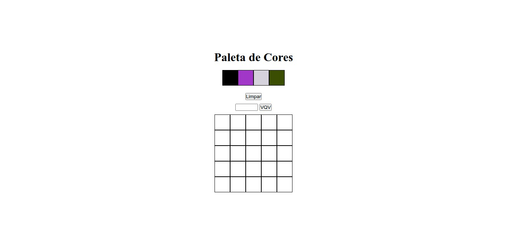

<h1 align="center">
  
</h1>

<h3 align="center">
  Curso realizado na Trybe - Edu Souza o/
</h3>

<blockquote align="center">“Os livros são amigos que nunca nos decepcionam - Thomas Carlyle”</blockquote>

<h4 align="center">
  Repositório -  Arte com pixels
</h4>

 

  &nbsp;
  &nbsp;
  

  <a href="#rocket-Sobre-o-projeto">Sobre o projeto</a>&nbsp; &nbsp; |&nbsp; &nbsp;
  <a href="#postbox-Entrega"">Entrega</a>&nbsp; &nbsp; |&nbsp; &nbsp;
  <a href="#unlock-Licença">Licença</a>

## :rocket: Sobre o projeto

####  Arte com pixels

Neste projeto, você implementará um editor de arte com pixels. Ou seja, dada uma paleta de cores e um quadro composto por pixels, você vai permitir que quem usa consiga pintar o que quiser no quadro!

#### Screenshots:

   &nbsp;

## :postbox: Entrega

### :clipboard: Requisitos

- 
<a href="#1"> :pushpin: 1.</a> A página deve possuir o título "Paleta de Cores.

- 
<a href="#2"> :pushpin: 2.</a> A página deve possuir uma paleta de quatro cores distintas.

- 
<a href="#3"> :pushpin: 3.</a> A cor **preta** deve ser a primeira na paleta de cores.

- 
<a href="#4"> :pushpin: 4.</a> A página deve possuir um quadro de pixels, com 25 pixels.

- 
<a href="#5"> :pushpin: 5.</a> Cada elemento do quadro de pixels deve possuir 40 _pixels_ de largura e 40 _pixels_ de altura e ser delimitado por uma borda preta de 1 pixel.

- 
<a href="#6"> :pushpin: 6.</a> Ao carregar a página, a cor **preta** da paleta já deve estar selecionada para pintar os pixels.

- 
<a href="#7"> :pushpin: 7.</a> Ao clicar em uma das cores da paleta, a cor selecionada é que vai ser usada para preencher os pixels no quadro.

- 
<a href="#8"> :pushpin: 8.</a> Ao clicar em um pixel dentro do quadro após selecionar uma cor na paleta, o pixel deve ser preenchido com esta cor.

- 
<a href="#9"> :pushpin: 9.</a> Crie um botão que, ao ser clicado, limpa o quadro preenchendo a cor de todos seus pixels com branco.

- 
<a href="#10"> :pushpin: 10.</a> Faça o quadro de pixels ter seu tamanho definido pelo usuário.

- 
<a href="#11"> :pushpin: 11.</a> Limite o tamanho do mínimo e máximo do board.

- 
<a href="#12"> :pushpin: 12.</a> Faça com que as cores da paleta sejam geradas aleatoriamente ao carregar a página.

### Concluído :rocket:

Acesse o deploy do projeto [aqui](https://edusouza-programmer.github.io/Trybe_Projeto_5-5_Edu_Souza/).

#
## :unlock: Licença

Este projeto está licenciado sob a Licença MIT - consulte [LICENSE](https://opensource.org/licenses/MIT) para maiores detalhes.
